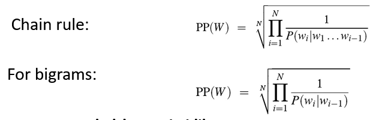

# 10 - Language Modeling

## Probabilistic Language Models
- **goal** - assign a probability to a sentence
  - *machine translation* - P(high winds tonight) > P(large winds tonight)
  - *spell correction* - the office is about fifteen minuets from my house
    - P(about fifteen minutes from) > P(about fifteen minuets from)
  - *speech recognition* - P(I saw a van) >> P(eyes awe of an)
  - summarization, question-answering, etc
  - $P(W)=P(w_1,w_2,w_3,w_4,w_5)$
- **related task** - probability of an upcoming word
  - $P(w_5|w_1,w_2,w_3,w_4)$
- **language model (LM)** - model that computes either of the two formulas
  - also called *grammar*
- how do we compute P(W)?
  - rely on **Chain Rule of Probability**

## Chain Rule
- definitions of conditional probabilities
  - $P(B|A) = \frac{P(A,B)}{P(A)}$
  - $P(A,B)=P(A)P(B|A)$
- **general equation**
  - $P(x_1,x_2,x_3,...,x_n)=P(x_1)P(x_2|x_1)P(x_3|x_1,x_2)...P(x_n|x_1,...,x_{n-1})$

## Applied Chain Rule
- **applied** to *joint probability of words* in a sentence
  - $P(w_1w_2...w_n)=\Pi{i}\ {P(w_i|w_1w_2...w_{i-1})}$
  - sidenote: latex sucks so if you see $\Pi {i}$ that means i is the bound, not multiplying the rest of the stuff by i
- example: P("its water is so transparent")
  - $=P(its)\times P(water|its)\times P(so|its\ water\ is)\times P(transparent|its\ water\ is\ so)$
- **naive estimation** - count and divide
  - $P(the|its\ water\ is\ so\ transparent\ that)=\frac{Count(its\ water\ is\ so\ transparent\ that\ the)}{Count(its\ water\ is\ so\ transparent\ that)}$
  - but there are *way too many* possible sentences
  - never see enough data for estimating

## Markov Assumption
- *simplify* assumption
- approximate each component in the product
  - $P(w_i|w_1w_2...w_{i-1}\approx P(w_i|w_{i-k}...w_{i-1})$
- **unigram model** - simplest case
  - $P(w_1w_2...w_n)\approx \Pi{i}{\ P(w_i)}$
- **bigram model** - condition on the previous word
  - $P(w_i|w_1w_2...w_{i-1})\approx P(w_i|w_{i-1})$
- **n-gram models** - can extend to trigrams, 4-grams, etc
  - in general this is an *insufficient model of language* because language has **long-distance dependencies**
    - words that have meaning tied with another part of the sentence may be many many words separated
  - we can often get away with n-gram models though

## Estimating Bigram Probabilities
- **maximum likelihood estimate**
  - count abbreviated to c in following formulas
  - $P(w_i|w_{i-1})=\frac{c(w_{i-1},w_i)}{c(w_{i-1})}$
- example:
  - I am Sam. Sam I am. I do not like green eggs and ham.
  - P(Sam | am) = 1/2
  - P(am | I) = 2/3
  - P(do | I) = 1/3
- **raw bigram count table** - (row, column) is count of times that row column appears in the given sentences
  - to get probabilities, normalize by the unigrams
  - see HW4
- **practical issues** - we do everything in log space
  - avoid *underflow*
  - adding is faster than multiplying
  - $\log(p_1\times p_2\times p_3\times p_4)=\log p_1+\log p_2+\log p_3+\log p_4$

## Evaluation
- does our language model prefer *good* sentences to *bad* ones?
- assign higher probability to *real* or *frequently observed* sentences than *ungrammatical* or *rarely observed* sentences
- train parameters of the model on a **training set**
- test the model's performance on data it has not seen
  - **test set** - unseen dataset that is different from the training set, totally unused
  - **evaluation metric** - how well the model does on the test set
- training on the **test set**
  - cannot allow test sentences in the training set
  - assign it an artificially high probability when we set it in the test set
  - training on the test set is bas science and violates the honor code
- **extrinsic** evaluation of **n-gram models** - best evaluation for comparing models A and B
  - put each model in a task, such as spelling corrector, speech recognizer, MT system, etc
  - run the task, get an *accuracy* for A and for B
    - how many misspelled words corrected properly
    - how many words translated correctly
    - etc
  - compare accuracy for A and B
  - **difficulty** - time-consuming, can take days or weeks
- **intrinsic** evaluation - **perplexity**
  - bad approximation, unless test data looks just like the training data
  - generally only useful in *pilot experiments*
  - helpful to think about though

## Perplexity
- **Shannon Game** - how well can we predict the next word?
  - unigrams are terrible at this due to only calculating the probability of a word, not with context in sentence
  - a better model of text is one which assigns a higher probability to the word that actually occurs
- **best language model** is one that best predicts an unseen test set, so it gives the highest P(sentence)
- **perplexity** - inverse probability of the test set, *normalized* by the number of words
- **!!!** minimizing perplexity is the same as maximizing probability **!!!**
- equations (I hope we don't need to memorize these...)
  - 
- perplexity as a **branching factor**
  - example: sentence consists of random digits
    - perplexity of the sentence according to a model that assigns P=1/10 to each digit?
    - $PP(W)=P(w_1w_2...w_N)^{-{\frac{1}{N}}}$
    
      $PP(W)=({\frac{1}{10}}^N)^{-{\frac{1}{N}}}=\frac{1}{10}^{-1}=10$
- lower perplexity = *better model*

## Generalization
- **Shannon Visualization Method**
  - choose a random bigram (\<s>, w) according to its probability
  - now choose a random bigram (w, x) according to its probability
  - and so on until we choose \</s>
  - then string the words together
- **perils of overfitting** - N-grams only work well for word prediction if the test corpus looks like the training corpus
  - in reality, it often does not
  - need to train robust models that *generalize*
  - one kind of generalization - **zeros**
    - things that do not ever occur in the training set, but occur in the test set
  
## Zeros
- training set:
  - ...denied the allegations
  - ...denied the reports
  - ...denied the claims
  - ...denied the request
- test set:
  - ...denied the offer
  - ...denied the loan
- P("offer" | denied the) = 0
- **zero probability bigrams** - bigrams with zero probability that means we will assign 0 probability to the test set
  - and thus we cannot compute perplexity, we cannot divide by 0

## Laplace Add-One Smoothing
- **smoothing intuition** - when we have sparse statistics, steal probability mass to generalize better
- **Laplace Add-One smoothing** - pretend we saw each word one more time than we did
  - add one to all counts
  - traditional MLE estimate: $P_{MLE}(w_i|w_{i-1})=\frac{c(w_{i-1},w_i)}{c(w_{i-1})}$
  - Add-1 estimate: $P_{Add-1}(w_i|w_{i-1})=\frac{c(w_{i-1},w_i)+1}{c(w_{i-1})+V}$
- **maximum likelihood estimates (MLE)** - maximizes the likelihood of the training set T given the model M based on some parameter of a model M from a training set T
  - example: suppose word "bagel" occurs 400 times in a corpus of a million words
    - probability that a random word from some other text will be "bagel"?
    - MLE estimate = 400/1,000,000 = 0.0004
  - may be a bad estimate for some other corpus
    - but it is the *estimate* that makes it *most likely* that "bagel" will occur 400 times in a million word corpus
- Add-1 is a *blunt instrument*, so it is not used for N-grams
- used to smooth other NLP models for text classification and in domains where the number of zeros is not huge