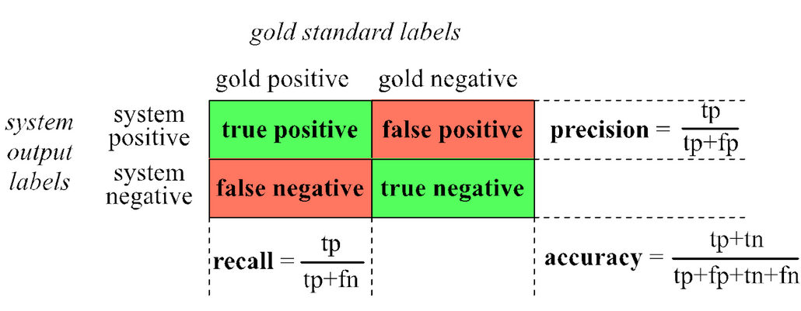
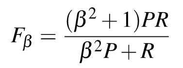

# 11 - Naive Bayes

## Text Classification
- **input** - a document $d$ and a fixed set of classes $C=\{c_1,c_2,...,c_j\}$
- **output** - a predicted class $c \in C$
- *classification methods* - **hand-coded rules**
  - rules based on combinations of words or other features
  - accuracy can be high, if rules carefully refined by expert
  - but building and maintaining these rules is *expensive*
- *classification *methods* - **supervised machine learning**
  - **input** - a document $d$, a fixed set of classes $C=\{c_1,c_2,...,c_j\}$, and a training set of $m$ hand-labeled documents $(d_1,c_1),...,(d_m,c_m)$
  - **output** - a learned classifier $\gamma :d\rArr c$
  - any kind of classifier
    - naive bayes
    - logistic regression
    - neural networks
    - k-nearest neighbors
    - etc

## Naive Bayes Classifier
- **intuition for Naive Bayes** - simple classification method based on Bayes rule
  - relies on very simple representation of document, *bag of words*
- **Bayes' Rule** - for a document $d$ and a class $c$, $P(c|d)=\frac{P(d|c)P(c)}{P(d)}$
- **Naive Bayes Classifier**
  - MAP = most likely class
  - $c_{MAP}=\argmax {(c\in C)}{P(c|d)}$
  - using Bayes' Rule, can simplify to
  - $c_{MAP}=\argmax {(c\in C)}{P(d|c)P(c)}$
  - where $P(d|c)$ is the *likelihood* and $P(c)$ is the *prior*
  - $d$ can be represented as features $x_1,...,x_n$
  - $O(|X|^n\times |C|)$ parameters
    - could only be estimated if a very, very large number of training examples was available
    - we can just count the relative frequencies in a corpus

## Multinomial Naive Bayes
- **independence assumptions** - $P(x_1,x_2,...,x_n|c)$
- **bag of words assumption** - assume position does not matter
- **conditional independence** - assume the feature probabilities $P(x_i|c_j)} are independent given the class $c$
  - $P(x_1,x_2,...,x_n|c)=P(x_1|c)\times P(x_2|c)\times P(x_3|c)\times ...\times P(x_n|c)$
- $c_{NB}=\argmax {(c\in C)}{\ \Pi {(x\in X)}{\ P(x|c)}}$
- **problem** with multiplying lots of probabilities
  - can result in floating point underflow
  - *solution* - use logs since multiplications become additions
  - taking log does not change the ranking of classes
  - linear model - max of a sum of weights, so it is a linear function of the inputs
- Naive Bayes is a **linear classifier**

## Learning
- *first attempt* - use MLE with the frequencies in the data
  - $P(w_i|c_j)=\frac{count(w_i,c_j)}{\Sigma {(w\in V)}{\ count(w,c_j)}}$
  - fraction of times word $w_i$ appears among all words in documents of topic $c_j$
  - create *mega-document* for topic $j$ by concatenating all docs in this topic
    - use frequency of $w$ in mega-document
  - **problem** - what if we have seen no training documents with a word classified in a class?
    - we will get 0
    - cannot condition away zero probabilities no matter what
    - **solution** - Laplace Add-1 smoothing, same idea as with Markov assumptions, add one to all counts
- **unknown words** - what do we do with them that appear in the test data but not in the training data or vocabulary?
  - **ignore them** - remove from test document, pretend they were not there
    - do not include any probability for them at all
  - building an unknown word model does not help, knowing which class has more unknown words is *not generally helpful*
- **stop words** - very frequent words like "the" and "a"
  - some systems ignore them
    - but usually does not help
  - sort vocabulary by word frequency in a training set
  - call the top 10 or 50 words the *stopword list*
  - remove all stop words from both training and test sets, as if they were never there to begin with

## Relationship to Language Modeling
- **generative model of NB** - graph of the words that are classified to a specific class
- NB classifiers can use any sort of *feature*
  - i.e. URL, email address, dictionaries, network features
  - we use **only** word features
  - we use **all** of the words in the text, not a subset
  - then NB has an *important similarity* to language modeling
- **each class = a unigram language model**
  - assigning each word: $P(word|c)$
  - assigning each sentence: $P(s|c)=\Pi \ P(word|c)$
  - example: each word and their probability it is positive class
    - I = 0.1, love = 0.1, this = 0.05, fun = 0.01, film = 0.1
    - P(sentence | positive) = 0.1 x 0.1 x 0.05 x 0.01 x 0.1 = 0.0000005
  - example: using positive class from previous and given new negative class, which one assigns the higher probability to sentence?
    - negative: I = 0.2, love = 0.001, this = 0.01, fun = 0.005, film = 0.1
    - P(sentence | negative) = $10^{-9}$
    - P(sentence | positive) > P(sentence | negative)

## Naive Bayes Evaluation
- **2 by 2 confusion matrix**
  - 
- **accuracy** - do not use as the evaluation metric
  - useless, does not return what we are looking for
  - can get amazing accuracy for very dumb labeling that is not very representative of the data as a whole
  - use *precision* and *recall* instead
- **precision** - percent of items the system detected (i.e. items the system labeled as positive) that are positive (according to human gold labels)
  - $precision=\frac{true\ positives}{true\ positives\ +\ false\ positives}$
- **recall** - percent of items actually present in the input that were correctly identified by the system
  - $recall=\frac{true\ positives}{true\ positives\ +\ false\ negatives}$
- precision and recall, not accuracy, emphasize **true positives** - finding the things that we are supposed to be looking for
- **combined measure F** - a single number that combines both *precision* and *recall*
  - 
  - almost always use balanced $F_1$ ($\beta =1$)
    - $F_1=\frac{2PR}{P+R}$

## Cross-Validation
- **devsets** - development test sets
- train on training set, tune on devset, report on test set
  - avoids *overfitting* - tuning to the test set
  - more conservative estimate of performance
  - **paradox** - want as much data as possible for training and as much for dev, so how do you split it?
- **cross-validation** - multiple splits
  - pool results over splits, compute pooled dev performance

## Harms in Classification
- can have biases in classifiers that perpetuate negative stereotypes against a certain group of people, etc
  - or censorship of discussion about a group of people
- **causes of harms**
  - problems in the training data, ML systems known to amplify biases in their training data
  - problems in the human labels
  - problems in the resources used (like lexicons)
  - problems in the model architecture (like what the model is trained to optimize)
- **mitigation** of these harms is an *open research area*
- **model cards** - for each algorithm you release, document:
  - training algorithms and parameters
  - training data sources, motivation, and preprocessing
  - evaluation data sources, motivation, and preprocessing
  - intended use and users
  - model performance across different demographic or other groups and environmental situations

