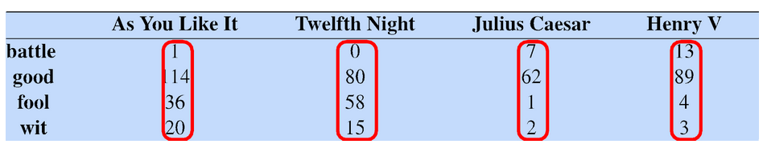
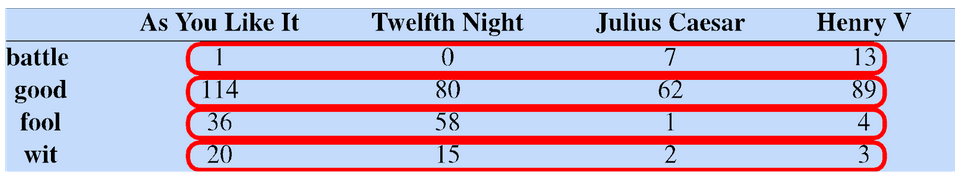
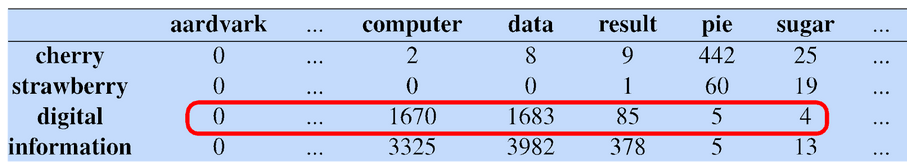
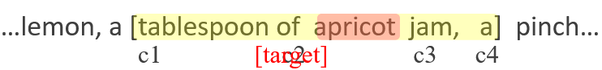

# 12 - Vector Semantics

## Word Meaning
- in N-gram or text classification methods, words are just strings
  - not very satisfactory
- from **lexical semantics**, the linguistic study of word meaning
- **sense/concept** - meaning component of a word
- lemmas can be **polysemous** - have multiple senses

## Word Relation
- **synonyms** - words that have the same meaning in some or all contexts
  - there are probably no examples of perfect synonymy, even if many aspects of meaning are identical
    - still may differ bassed on politeness, slang, register, genre, etc
- **similarity** - words with similar meanings
  - not synonyms, but *sharing some* element of meaning
- **word relatedness/association** - relation of words in any way, such as via a semantic frame or field
  - coffee, tea are similar
  - coffee, cup are related, but not similar
- **semantic field** - words that
  - cover a particular *semantic domain*
  - bear *structured relations* with each other
  - hospitals - surgeon, scalpel, nurse, hospital
  - restaurants - waiter, menu, plate, food, chef
  - houses - door, roof, kitchen, family, bed
- **antonymy** - senses that are opposite with respect to only one feature of meaning
  - otherwise they are very similar
  - dark/light, short/long, fast/slow, rise/fall, hot/cold, etc
  - more formally, *anyonymy* can
    - define a binary opposition or be at opposite ends of a scale (i.e. long/short, fast/slow)
    - be *reversives* (i.e. rise/fall, up/down)
- **connotation** - words have affective meanings
  - positive or negative
  - can be *subtle*
  - evaluation is the sentiment
  - words seem to vary along **3 affective dimensions**
    - **valence** - the pleasantness of the stimulus
    - **arousal** - the intensity of emotion provoked by the stimulus
    - **dominance** - the degree of control exerted by the stimulus
- *summary so far*
  - concepts or word senses have a complex many-to-many association with words
  - have relations with each other

## Vector Semantics
- **vector semantics** - model in language processing
- define words by their **usage** - defined by their environments (words around them)
- if A and B have almost identical environments we say that they are **synonyms**
- **idea 1** - define meaning by *linguistic distribution*
  - distribution in language use = neighboring words or grammatical environments
- **idea 2** - define meaning as a *point in space*
  - 3 affective dimensions for a word
  - connotation of a word is a vector in 3-space
  - each word is a **vector**
  - similar words are *nearby in semantic space*
  - build this space *automatically* by seeing which words are nearby in text
- define meaning of a word as a **vector**
  - called an **embedding** because it is embedded into a space
  - standard way to represent meaning in NLP
  - fine-grained model of meaning for similarity
- **but why vectors?**
  - consider *sentiment analysis*
    - with **words** a feature is a word identity
      - feature 5: "the previous word was "terrible"" requires *exact same word* to be in training and test
    - with **embeddings** feature is a *word vector*
      - "the previous word was vector [35, 22, 17...]
      - now in the test set we might see a similar vector [34, 21, 14...]
      - we can generalize to *similar but unseen* words
- 2 kinds of embeddings
  - **tf-idf**
    - information retrieval workhorse
    - common baseline model
    - *sparse* vectors
    - words are represented by the *counts* of nearby words
  - **word2vec**
    - *dense* vectors
    - representation is created by training a classifier to *predict* whether a word is likely to appear nearby
- now we are computing with meaning representations instead of string representations

## Words and Vectors
- **term-document matrix** - each document is represented by a vector of words
  - 
  - can visualize with a graph where one word is x axis and another is y
- vectors are the basis of *information retrieval*
  - in previous matrix, vectors are similar for the two comedies, but comedies are different than the other two
    - comedies have more fools and wit and fewer battles
- words can be vectors too
  - 
  - battle is the kind of word that occurs in Julius Caesar and Henry V
  - fool is the kind of word that occurs in comedies, especially Twelfth Night
- **word-word/term-context matrix** - two words are similar in meaning if their context vectors are similar
  - more commonly used
  - 
  - if context is a document, cells represent the number of times both the words appeared in the same document

## Computing Word Similarity
- dot product between two vectors is a scalar
  - $dot\ product(v,w)=v\cdot w = v_1w_1+v_2w_2+...+v_Nw_N$
- dot product tends to be high when the two vectors have large values in the same dimensions
- dot product can thus be a useful *similarity metric* between two vectors
- **problem** with raw dot-product
  - favors long vectors
  - higher if a vector is longer (has higher values in many dimensions)
  - **vector length** - $|v|=\sqrt{\Sigma {(i=1:N)}{\ v_i^2}}$
  - frequent words (of, the, you) have long vectors, since they occur many times with other words
  - therefore, dot product *overly favors frequent words*
- **alternative** - use cosine for computing word similarity
  - $\frac{a\cdot b}{|a|\ |b|}=\cos \theta$
  - -1 = vectors point in opposite directions
  - +1 = vectors point in the same directions
  - - = vectors are orthogonal (perpendicular, form 90 degrees)
  - but since raw frequency values are non-negative, the cosine for term-term matrix vectors range from 0-1

## TF-IDF
- raw frequency is a *bad representation*
  - co-occurrence matrices we have seen represent each cell by word frequencies
  - frequency is clearly useful, if sugar appears a lot near apricot, that is useful information
  - but overly frequent words like the, it, or they are not very informative about the context
  - how can we balance these two conflicting constraints?
- **solutions for word weighting**
  - **tf-idf** - turn-frequency-inverse document frequency (tf-idf) for word t in document d
    - $w_{t,d}=tf_{t,d}\times idf_t$
    - words like the or it have very low idf
  - **pointwise mutual information (PMI)** - see if words like good appear more often with great than we would expect by chance
    - $PMI(w_1,w_2)=\log \frac{p(w_1,w_2)}{p(w_1)p(w_2)}$
- **turn frequency (tf)** - $tf_{t,d}=count(t,d)$
  - instead of using raw count, we can squash it a bit: $tf_{t,d}=\log base10\ (count(t,d)+1)$
- **document frequency (df)**
  - $df_t$ is the number of documents $t$ occurs in
  - this is *not collection frequency* - total count across all documents
- **inverse document frequency (idf)**
  - $idf_t=\log base10\ (\frac{N}{df_t})$, N is the total number of documents in the collection
- **document** - can be anything, often call each paragraph a document
- **final tf-idf weighted value** for a word
  - $w_{t,d}=tf_{t,d}\times idf_t$

## Sparse vs. Dense Vectors
- tf-idf or PMI vectors are
  - *long* - length |V| = 20,000 to 50,000
  - *sparse* - most elements are 0
- **alternative** - learn vectors which are
  - *short* - length 50 to 1,000
  - *dense* - most elements are non-zero
- why **dense vectors**?
  - short vectors may be *easier* to use as *features* in ML - fewer weights to tune
  - dense vectors may *generalize* better than explicit counts
  - dense vectors may do better at capturing synonymy
    - car and automobile are synonyms, but are distinct dimensions
    - a word with car as a neighbor and a word with automobile as a neighbor should be similar, but are not
  - **in practice, they work better**
- common methods for getting *short dense vectors*
  - "neural language model" inspired models - word2vec, GloVe
  - singular value decomposition (SVD) - special case is Latent Semantic Analysis (LSA)
  - alternatives to these static embeddings
    - contextual embeddings (ELMo, BERT)
    - compute distinct embeddings for a word in its context
    - separate embeddings for each token of a word

## Word2vec
- popular embedding method
- very fast to train
- code available on the web provided by Google
- **idea** - *predict* rather than *count*
- provides various options, such as skip-gram or continuous bag of words (CBOW)
  - we will use skip-gram
- instead of *counting* how often each word $w$ occurs near apricot, train a **classifier** on a **binary prediction** task
  - is $w$ likely to show up near apricot?
  - don't actually care about this task, but we will take the learned classifier weights as the *word embeddings*
- **big idea** - **self supervision**
  - a word c that occurs near apricot in the corpus acts as the gold correct answer for supervised learning
  - no need for human labels
- **approach** - predict if candidate word c is a *neighbor*
  1. treat the target word t and a neighboring context word c as **positive examples**
  2. randomly sample other words in the lexicon to get **negative examples**
  3. use *logistic regression* to train a classifier to distinguish those two cases
  4. use the learned weights as the embeddings
- **skip-gram training data** - assume a +/- 2 word window, given training sentence
  - 
  - target is apricot, google slides didn't make it go under right word -_-
  - **goal** - train a classifier that is given a candidate (word, context) pair and assigns each pair a probability
    - $P(+|w,c), P(-|w,c)=1-P(+|w,c)$
- **similarity** is computed from dot product
  - two vectors are *similar* if they have a high dot product
  - cosine is just a *normalized* dot product
  - $similarity(w,c)\propto w\cdot c$
    - similarity is proportional to the dot product
  - have to normalize to get a probability, cosine is not a probability either
    - use the sigmoid from *logistic regression*
      - and there is where I don't think we went over anything more

