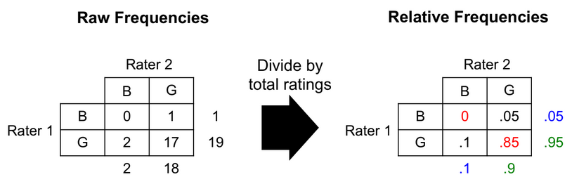
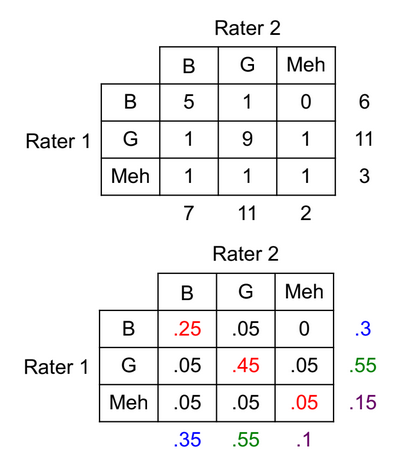

# 7 - Kappa

## Inter-Rater Reliability
- Dialogue Act Classification
  - can be straightforward, i.e. question, declaration, apology
  - can be subject to interpretation
    - yeah, right - agreement or sarcasm?
    - what!? - question, exclamation, or reaction?
  - **solution** - test how well two people agree on given dialogue acts
    - **inter-rater reliability**
- **inter-rater reliability** - degree of agreement between raters where raters work independently of each other
  - application - *validation* of rating protocols
- useful when rating protocols are ambiguous
  - applying dialogue act tags
  - codes from thematic analysis
  - judging the quality of something
## Agreement Calculations
- **agreement** - probability that you and your partner selected the same tag for an item on the list
  - $agreement = \frac{count(item\ rated\ the\ same)}{count(item)}$
- **observed vs. expected agreement** - determine what agreement was likely due to chance
  - **observed agreement** - probability that items were rated the same
$P(items\ rated\ the\ same)$
  - **expected agreement** - sum over all ratings
    - $P(item\ rated\ by\ both\ as\ X)$
    - $=P(judge\ 1\ rated\ X \cap judge\ 2\ rated\ X)$
  - if judges rated independently
    - $P(judge\ 1\ rated\ X) * P(judge\ 2\ rated\ X)$
- example
  - rate 20 items good or bad
  - rater 1 rated 1 item bad rest good
  - rater 2 rated 2 items bad rest good
  - all the bad rates, the other rater rated that item as good
  - observed agreement = 17 / 20 = 0.85
  - expected agreement - make table where entry is the count that the rater rated items that class out of all items

    | | Rater 1 | Rater 2 |
    | -----|-------|------|
    |Bad|0.05|0.10|
    |Good|0.95|0.90
  - bad = 0.05 x 0.10 = 0.005
  - good = 0.95 x 0.90 = 0.855
  - total = 0.855 + 0.005

## Cohen's Kappa
- measures the degree to which two raters' agreement exceeds chance
  - $k=\frac{O-E}{1-E}$
- O is observed agreement, E expected agreement
- from previous example 
  - O = 0 + 0.85 = 0.85
  - E = (0.05 x 0.1) + (0.95 x 0.9) = 0.86
  - k = (0.85 - 0.86) / (1 - 0.86) = -0.071, poor agreement
- kappa ranges from -1 to 1
  - k > 0 indicates agreement better than chance
    - k = 1 perfect agreement
  - k < 0 indicates agreement worse than chance
    - k = -1 perfect disagreement and 50% expected agreement
  - applicable when data are *nominal* and *unordered*
- |Score|Interpretation|
  |---|---|
  |< 0|poor|
  |0 - 0.2|slight|
  |0.2 - 0.4|fair|
  |0.41 - 0.6|moderate|
  |0.61 - 0.8|substantial|
  |0.81 - 1|almost perfect|
- example
  - 
  - O = 0.25 + 0.45 + 0.05 = 0.75
  - E = (0.3 x 0.35) + (0.55 x 0.55) + (0.15 x 0.1) = 0.4225
  - k = (0.75 - 0.4225) / (1 - 0.4225) = 0.57, moderate agreement

## Applications
- dialogue act classification
  - define a set of dialogue tags and detailed descriptions for each one
  - train secondary annotators on how to use your tagging scheme
  - calculate kappa on subset of data (generally around 20%)
  - if kappa is too low, retrain and repeat
  - standard practices for corpus-based research
    - one or more annotators tag entire corpus split across each annotator
    - kappa computed on double-tagged portion of corpus, around 20%
    - kappa of around 0.8 is generally acceptable for dialogue act tags
      - lower kappas are acceptable depending on the task
      - tagging uncertainty, disengagement, etc

## Weighted Kappa
- **weighted kappa** - accounts for degree of disagreement
- useful when ratings are ordered
  - i.e. disagreement between good and bad should have more weight than disagreement between good and meh
- consists of **3 matrices**
  - observed agreement matrix
  - expected agreement matrix
  - weight matrix
- **observed agreement matrix** - same as the contingency matrix = X
- **expected agreement matrix** - probabilities for each pair of ratings = M
  - $m{_{ij}}=\frac{(rater\ 1's\ i\ ratings)\times(rater\ 2's\ j\ ratings)}{total\ data\ points}$
- **weight matrix** - each cell in the contingency matrix = W
  - matrix diagonal is zero, no penalty for agreement
  - other weights determined by distance between ratings
    - good/meh and meh/bad = 1, good/bad = 2
- $k = 1-\frac{\sum{\sum{w_{ij}x_{ij}}}}{\sum{\sum{w_{ij}m_{ij}}}}$
  - sum of products of weight and observed agreement matrices divided by sum of products of weight and expected agreement matrices

## Other Inter-Rater Reliability Methods
- **Fleiss' kappa** - multiple raters, ordinal data
  - alternative - average pairwise Cohen's kappa
- **Pearson's correlation coefficient and Spearman's rank correlation coefficient** - used for continuous data
- **Krippendorff's alpha** - generalizable to multiple raters and data types
- **Cronbach's alpha** - validating psychometric test items

