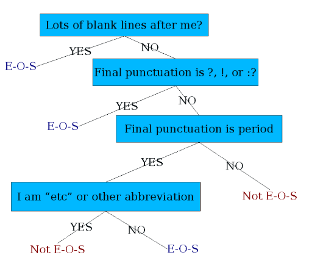
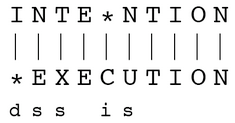
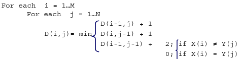

# 9 - Basic Text Processing

## Regular Expressions
- formal language for specifying text strings
- process based on fixing two kinds of errors
  - matching strings that we should not have matched (there, then, other)
    - *false positives*
  - not matching things that we should have matched (the)
    - *false negatives*
- sophisticated sequences of regular expressions are often the first model for any text processing
  - therefore play a large role
- for many hard tasks, use machine learning classifiers
  - but regular expressions are used as features in the classifiers
  - can be very useful in capturing generalizations

## Word Tokenization
- **text normalization**
  1. segmenting/tokenizing words in running text
  2. normalizing word formats
  3. segmenting sentences in running text
- can be hard to determine how many words are in an utterance
  - "I do uh main- mainly business data processing" - fragments, filled pauses
  - "Suess's cat in the hat is different from other cats!"
    - lemma - same stem, part of speech, rough worse sense
      - cat and cats = same lemma
    - wordform - the full inflected surface form
      - cat and cats = different wordforms
    - "they lay back on the San Francisco grass and looked at the stars and their"
      - **type** - an element of the vocabulary
      - **token** - an instance of that type in running text
      - 15 tokens, 13 types
- issues in tokenization
  - "Finland's capital" -> Finland, Finlands, Finland's?
  - "what're, I'm, isn't" -> what are, I am, is not
  - "Hewlett-Packard" -> Hewlett Packard?
  - "state-of-the-art" -> state of the art?
  - "Lowercase" -> lower-case, lowercase, lower case?
  - "San Francisco" -> one token or two?
  - "m.p.h., PhD." -> ??
- **normalization** - break words down to their equivalence classes of terms
  - information retrieval - indexed text and query terms must have same form, i.e. match U.S.A and USA as the same
  - implicitly define equivalence classes of terms
    - i.e. deleting periods in a term
  - *alternative* - asymmetric expansion
    - enter: window, search: window, windows
    - enter: windows, search: Windows, windows, window
    - enter: Windows, search: Windows
  - potentially more powerful, but less efficient
- **case folding** - reduce all letters to lower case
  - users tend to use lower case
  - possible exception - upper case in mid-sentence?
    - i.e. General Motors, Fed vs fed, SAIL vs sail
  - for sentiment analysis, MT, information extraction, case is helpful
    - US vs us is important
- **lemmatization** - reduce inflections or variant forms to base form
  - am, are, is -> be
  - car, cars, car's, cars' -> car
  - the boy's cars are different colors -> the boy car be different color
  - have to find correct dictionary headword form
  - machine translation
- **morphology**
  - **morphemes** - small meaningful units that make up words
  - *stems* - core meaning-bearing units
  - *affixes* - bits and pieces that adhere to stems
    - often with grammatical functions
- **stemming** - crude chopping of affixes
  - goal is to reduce terms to their stems in information retrieval
  - language dependent
  - automate, automatic, automation all reduced to automat
  - **Porter's algorithm** - most common English stemmer
  - only strip -ing if there is a verb
    - walking -> walk
    - sing -> sing

## Sentence Segmentation and Decision Trees
- **sentence segmentation** - meaning of punctuation
  - !, ? are relatively unambiguous
  - . is quite ambiguous
    - sentence boundary
    - abbreviations (Dr., Inc, etc)
    - numbers (.02, 4.3)
  - build a binary classifier
    - looks at a .
    - decides end of sentence or not end of sentence
    - *classifiers* - hand-written rules, regular expressions, or machine learning
- use a **decision tree** to determine if a word is end-of-sentence
  - 
  - more sophisticated decision tree features
    - word with period - upper, lower, caps, number
- implementing decision trees
  - decision tree is just an *if else* statement
  - interesting research is choosing the features
  - setting up the structure is often too hard to do by hand
    - hand building only possible for very simple features, domains
      - for numeric features, it's too hard to pick each threshold
    - instead, structure usually learned by machine learning from a training corpus
  - think of the questions in a decision tree as *features* that could be exploited by any kind of classifier
    - logistic regression
    - SVM
    - neural nets, etc

## Minimum Edit Distance
- **minimum edit distance** - minimum number of editing operations between to strings to transform one into the other
- **editing operations** - insert, delete, substitution
- example
  - 
  - strings need to be *aligned*
  - if each operation has cost of 1, distance between the two is 5
  - if substitutions cost 2, distance between them is 8
- other uses in NLP
  - evaluating machine translation and speech recognition
  - named entity extraction and entity co-reference
- finding min edit distance
  - search for path (sequence of edits) from the start string to the final string
  - *initial state* - word we are transforming
  - *operators* - insert, delete, substitute
  - *goal state* - word we are trying to get to
  - *path cost* - what we want to minimize, the number of edits
  - space of all edit sequences is huge
    - cannot afford to navigate naively
    - lots of distinct paths wind up at the same state, therefore we don't have to keep track of all of them, just the *shortest path* to each of those revised states
- **dynamic programming** - solving problems by combining solutions to subproblems
  - use it for a tabular computation of D(n, m)
  - *bottom-up* - we compute D(i, j) for small i, j, and compute larger D(i, j) based on previously computed smaller values
- Levenshtein
  - initialization - D(i, 0) = i, D(0, j) = j
  - recurrence relation
  - 
  - termination - D(N, M) is distance
  - create an edit distance table
- computing alignments
  - edit distance isn't sufficient
  - often need to *align* each character of the two strings to each other
  - do this by keeping a **backtrace**
    - every time we enter a cell, remember where we came from
  - when we reach the end, trace back the path from the upper right corner to read off the alignment
  - do this through the table
    - label each part of the path with a symbol
    - left = insertion
    - down = deletion
    - diagonal = substitution
  - an optimal alignment is composed of optimal subalignments
  - honestly just look at the slides for these looking at the tables and them transitioning makes it a lot easier to understand
  - **performance**
    - *time* - O(nm)
    - *space* - O(nm)
    - *backtrace* - O(n+m)
- **weighted edit distance** - add weights to the computation
  - *spell correction* - some letters are more likely to be mistyped than others
  - *biology* - certain kinds of deletions or insertions are more likely than others
- alignments in 2 fields
  - **NLP** - generally talk about *distance* (minimized) and *weights*
  - **Computational Biology** - generally talk about *similarity* (maximized) and *scores*
- Needleman-Wunsch - start at top left corner for edit table instead of bottom left
- variant of basic algorithm - might be ok to have unlimited number of gaps in the beginning and end
  - if so, we do not want to penalize gaps at the ends
- Smith-Waterman algorithm
  - ignore badly aligned regions
  - modify Needleman-Wunsch
  - want to have local alignment

