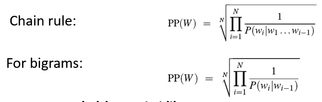
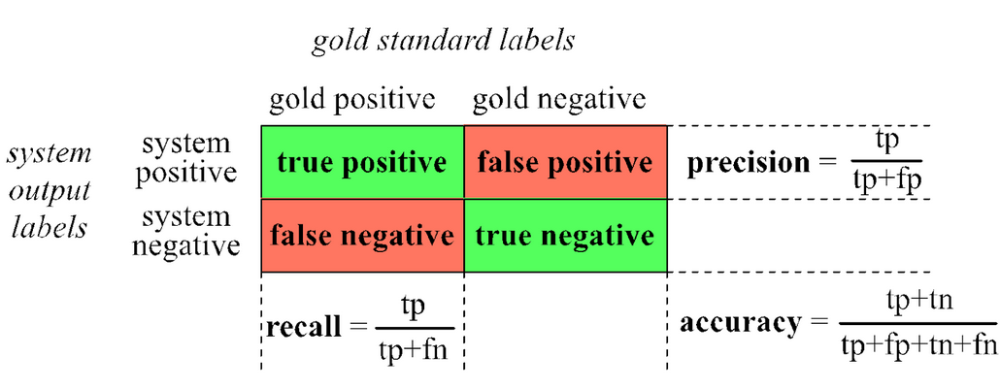
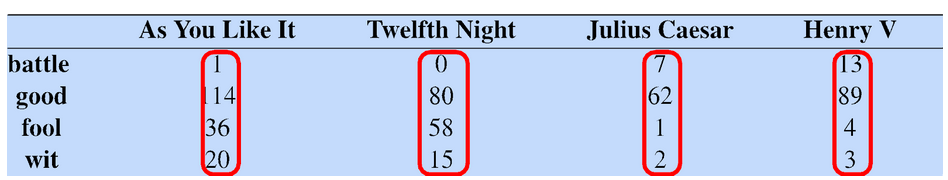
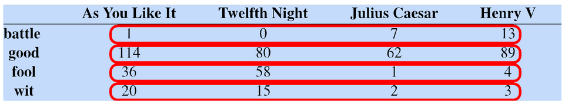

# SDS Exam 2 Notes

# Table of Contents <!-- omit in toc -->
- [SDS Exam 2 Notes](#sds-exam-2-notes)
- [1. 7 - Kappa](#1-7---kappa)
  - [1.1. Inter-Rater Reliability](#11-inter-rater-reliability)
  - [1.2. Agreement Calculations](#12-agreement-calculations)
  - [1.3. Cohen's Kappa](#13-cohens-kappa)
  - [1.4. Applications](#14-applications)
  - [1.5. Weighted Kappa](#15-weighted-kappa)
  - [1.6. Other Inter-Rater Reliability Methods](#16-other-inter-rater-reliability-methods)
- [2. 8 - Dialogue System Evaluation](#2-8---dialogue-system-evaluation)
  - [2.1. Dialogue Evaluation](#21-dialogue-evaluation)
  - [2.2. PARADISE Framework](#22-paradise-framework)
  - [2.3. Experimental Procedures](#23-experimental-procedures)
  - [2.4. Success Metric](#24-success-metric)
- [3. 9 - Basic Text Processing](#3-9---basic-text-processing)
  - [3.1. Regular Expressions](#31-regular-expressions)
  - [3.2. Word Tokenization](#32-word-tokenization)
  - [3.3. Sentence Segmentation and Decision Trees](#33-sentence-segmentation-and-decision-trees)
  - [3.4. Minimum Edit Distance](#34-minimum-edit-distance)
- [4. 10 - Language Modeling](#4-10---language-modeling)
  - [4.1. Probabilistic Language Models](#41-probabilistic-language-models)
  - [4.2. Chain Rule](#42-chain-rule)
  - [4.3. Applied Chain Rule](#43-applied-chain-rule)
  - [4.4. Markov Assumption](#44-markov-assumption)
  - [4.5. Estimating Bigram Probabilities](#45-estimating-bigram-probabilities)
  - [4.6. Evaluation](#46-evaluation)
  - [4.7. Perplexity](#47-perplexity)
  - [4.8. Generalization](#48-generalization)
  - [4.9. Zeros](#49-zeros)
  - [4.10. Laplace Add-One Smoothing](#410-laplace-add-one-smoothing)
- [5. 11 - Naive Bayes](#5-11---naive-bayes)
  - [5.1. Text Classification](#51-text-classification)
  - [5.2. Naive Bayes Classifier](#52-naive-bayes-classifier)
  - [5.3. Multinomial Naive Bayes](#53-multinomial-naive-bayes)
  - [5.4. Learning](#54-learning)
  - [5.5. Relationship to Language Modeling](#55-relationship-to-language-modeling)
  - [5.6. Naive Bayes Evaluation](#56-naive-bayes-evaluation)
  - [5.7. Cross-Validation](#57-cross-validation)
  - [5.8. Harms in Classification](#58-harms-in-classification)
- [6. 12 - Vector Semantics](#6-12---vector-semantics)
  - [6.1. Word Meaning](#61-word-meaning)
  - [6.2. Word Relation](#62-word-relation)
  - [6.3. Vector Semantics](#63-vector-semantics)
  - [6.4. Words and Vectors](#64-words-and-vectors)
  - [6.5. Computing Word Similarity](#65-computing-word-similarity)
  - [6.6. TF-IDF](#66-tf-idf)
  - [6.7. Sparse vs. Dense Vectors](#67-sparse-vs-dense-vectors)
  - [6.8. Word2vec](#68-word2vec)

# 1. 7 - Kappa

## 1.1. Inter-Rater Reliability
- Dialogue Act Classification
  - can be straightforward, i.e. question, declaration, apology
  - can be subject to interpretation
    - yeah, right - agreement or sarcasm?
    - what!? - question, exclamation, or reaction?
  - **solution** - test how well two people agree on given dialogue acts
    - **inter-rater reliability**
- **inter-rater reliability** - degree of agreement between raters where raters work independently of each other
  - application - *validation* of rating protocols
- useful when rating protocols are ambiguous
  - applying dialogue act tags
  - codes from thematic analysis
  - judging the quality of something
## 1.2. Agreement Calculations
- **agreement** - probability that you and your partner selected the same tag for an item on the list
  - $agreement = \frac{count(item\ rated\ the\ same)}{count(item)}$
- **observed vs. expected agreement** - determine what agreement was likely due to chance
  - **observed agreement** - probability that items were rated the same
$P(items\ rated\ the\ same)$
  - **expected agreement** - sum over all ratings
    - $P(item\ rated\ by\ both\ as\ X)$
    - $=P(judge\ 1\ rated\ X \cap judge\ 2\ rated\ X)$
  - if judges rated independently
    - $P(judge\ 1\ rated\ X) * P(judge\ 2\ rated\ X)$
- example
  - rate 20 items good or bad
  - rater 1 rated 1 item bad rest good
  - rater 2 rated 2 items bad rest good
  - all the bad rates, the other rater rated that item as good
  - observed agreement = 17 / 20 = 0.85
  - expected agreement - make table where entry is the count that the rater rated items that class out of all items

    | | Rater 1 | Rater 2 |
    | -----|-------|------|
    |Bad|0.05|0.10|
    |Good|0.95|0.90
  - bad = 0.05 x 0.10 = 0.005
  - good = 0.95 x 0.90 = 0.855
  - total = 0.855 + 0.005

## 1.3. Cohen's Kappa
- measures the degree to which two raters' agreement exceeds chance
  - $k=\frac{O-E}{1-E}$
- O is observed agreement, E expected agreement
- from previous example 
  - O = 0 + 0.85 = 0.85
  - E = (0.05 x 0.1) + (0.95 x 0.9) = 0.86
  - k = (0.85 - 0.86) / (1 - 0.86) = -0.071, poor agreement
- kappa ranges from -1 to 1
  - k > 0 indicates agreement better than chance
    - k = 1 perfect agreement
  - k < 0 indicates agreement worse than chance
    - k = -1 perfect disagreement and 50% expected agreement
  - applicable when data are *nominal* and *unordered*
- |Score|Interpretation|
  |---|---|
  |< 0|poor|
  |0 - 0.2|slight|
  |0.2 - 0.4|fair|
  |0.41 - 0.6|moderate|
  |0.61 - 0.8|substantial|
  |0.81 - 1|almost perfect|
- example
  - 
  - O = 0.25 + 0.45 + 0.05 = 0.75
  - E = (0.3 x 0.35) + (0.55 x 0.55) + (0.15 x 0.1) = 0.4225
  - k = (0.75 - 0.4225) / (1 - 0.4225) = 0.57, moderate agreement

## 1.4. Applications
- dialogue act classification
  - define a set of dialogue tags and detailed descriptions for each one
  - train secondary annotators on how to use your tagging scheme
  - calculate kappa on subset of data (generally around 20%)
  - if kappa is too low, retrain and repeat
  - standard practices for corpus-based research
    - one or more annotators tag entire corpus split across each annotator
    - kappa computed on double-tagged portion of corpus, around 20%
    - kappa of around 0.8 is generally acceptable for dialogue act tags
      - lower kappas are acceptable depending on the task
      - tagging uncertainty, disengagement, etc

## 1.5. Weighted Kappa
- **weighted kappa** - accounts for degree of disagreement
- useful when ratings are ordered
  - i.e. disagreement between good and bad should have more weight than disagreement between good and meh
- consists of **3 matrices**
  - observed agreement matrix
  - expected agreement matrix
  - weight matrix
- **observed agreement matrix** - same as the contingency matrix = X
- **expected agreement matrix** - probabilities for each pair of ratings = M
  - $m{_{ij}}=\frac{(rater\ 1's\ i\ ratings)\times(rater\ 2's\ j\ ratings)}{total\ data\ points}$
- **weight matrix** - each cell in the contingency matrix = W
  - matrix diagonal is zero, no penalty for agreement
  - other weights determined by distance between ratings
    - good/meh and meh/bad = 1, good/bad = 2
- $k = 1-\frac{\sum{\sum{w_{ij}x_{ij}}}}{\sum{\sum{w_{ij}m_{ij}}}}$
  - sum of products of weight and observed agreement matrices divided by sum of products of weight and expected agreement matrices

## 1.6. Other Inter-Rater Reliability Methods
- **Fleiss' kappa** - multiple raters, ordinal data
  - alternative - average pairwise Cohen's kappa
- **Pearson's correlation coefficient and Spearman's rank correlation coefficient** - used for continuous data
- **Krippendorff's alpha** - generalizable to multiple raters and data types
- **Cronbach's alpha** - validating psychometric test items

# 2. 8 - Dialogue System Evaluation

## 2.1. Dialogue Evaluation
- things we can measure about how well a dialogue went
  - user satisfaction
  - learning
  - task completion
  - how long they stayed with it
- outcomes
  - tell us how well a dialogue went
  - can be represented numerically in some way and then predicted based on what happened within the dialogues themselves
  - you need to keep records of what happened in the dialogues themselves

## 2.2. PARADISE Framework
- used to evaluate dialogue systems
- *performance* of a dialogue system is affected by both: 
  - *what* gets accomplished by the user and the dialogue agent and
  - *how* it gets accomplished
- maximize user satisfaction
  - maximize task success
  - minimize costs
    - efficiency measures
    - qualitative measures
- regress against user satisfaction
  - questionnaire to assign each dialogue a user satisfaction rating - *dependent* measure
  - cost and success factors - *independent* measures
  - use regression to train weights for each factor

## 2.3. Experimental Procedures
- subjects given specific tasks
- spoken dialogues recorded
- cost factors, states, dialogue acts automatically logged
- ASR accuracy, barge-in hand-labeled
- users specify task solution via web page
- users complete user satisfaction survey of some kind
- use **multiple linear regression** to model user satisfaction as a function of task success and costs
  - test for significant predictive factors

## 2.4. Success Metric
- could we use the success metric to drive automatic learning?
- methods for automatically evaluating system performance
- way of obtaining training data for further system development
- can we find intrinsic evaluation metrics that correlate with extrinsic results?

# 3. 9 - Basic Text Processing

## 3.1. Regular Expressions
- formal language for specifying text strings
- process based on fixing two kinds of errors
  - matching strings that we should not have matched (there, then, other)
    - *false positives*
  - not matching things that we should have matched (the)
    - *false negatives*
- sophisticated sequences of regular expressions are often the first model for any text processing
  - therefore play a large role
- for many hard tasks, use machine learning classifiers
  - but regular expressions are used as features in the classifiers
  - can be very useful in capturing generalizations

## 3.2. Word Tokenization
- **text normalization**
  1. segmenting/tokenizing words in running text
  2. normalizing word formats
  3. segmenting sentences in running text
- can be hard to determine how many words are in an utterance
  - "I do uh main- mainly business data processing" - fragments, filled pauses
  - "Suess's cat in the hat is different from other cats!"
    - lemma - same stem, part of speech, rough worse sense
      - cat and cats = same lemma
    - wordform - the full inflected surface form
      - cat and cats = different wordforms
    - "they lay back on the San Francisco grass and looked at the stars and their"
      - **type** - an element of the vocabulary
      - **token** - an instance of that type in running text
      - 15 tokens, 13 types
- issues in tokenization
  - "Finland's capital" -> Finland, Finlands, Finland's?
  - "what're, I'm, isn't" -> what are, I am, is not
  - "Hewlett-Packard" -> Hewlett Packard?
  - "state-of-the-art" -> state of the art?
  - "Lowercase" -> lower-case, lowercase, lower case?
  - "San Francisco" -> one token or two?
  - "m.p.h., PhD." -> ??
- **normalization** - break words down to their equivalence classes of terms
  - information retrieval - indexed text and query terms must have same form, i.e. match U.S.A and USA as the same
  - implicitly define equivalence classes of terms
    - i.e. deleting periods in a term
  - *alternative* - asymmetric expansion
    - enter: window, search: window, windows
    - enter: windows, search: Windows, windows, window
    - enter: Windows, search: Windows
  - potentially more powerful, but less efficient
- **case folding** - reduce all letters to lower case
  - users tend to use lower case
  - possible exception - upper case in mid-sentence?
    - i.e. General Motors, Fed vs fed, SAIL vs sail
  - for sentiment analysis, MT, information extraction, case is helpful
    - US vs us is important
- **lemmatization** - reduce inflections or variant forms to base form
  - am, are, is -> be
  - car, cars, car's, cars' -> car
  - the boy's cars are different colors -> the boy car be different color
  - have to find correct dictionary headword form
  - machine translation
- **morphology**
  - **morphemes** - small meaningful units that make up words
  - *stems* - core meaning-bearing units
  - *affixes* - bits and pieces that adhere to stems
    - often with grammatical functions
- **stemming** - crude chopping of affixes
  - goal is to reduce terms to their stems in information retrieval
  - language dependent
  - automate, automatic, automation all reduced to automat
  - **Porter's algorithm** - most common English stemmer
  - only strip -ing if there is a verb
    - walking -> walk
    - sing -> sing

## 3.3. Sentence Segmentation and Decision Trees
- **sentence segmentation** - meaning of punctuation
  - !, ? are relatively unambiguous
  - . is quite ambiguous
    - sentence boundary
    - abbreviations (Dr., Inc, etc)
    - numbers (.02, 4.3)
  - build a binary classifier
    - looks at a .
    - decides end of sentence or not end of sentence
    - *classifiers* - hand-written rules, regular expressions, or machine learning
- use a **decision tree** to determine if a word is end-of-sentence
  - 
  - more sophisticated decision tree features
    - word with period - upper, lower, caps, number
- implementing decision trees
  - decision tree is just an *if else* statement
  - interesting research is choosing the features
  - setting up the structure is often too hard to do by hand
    - hand building only possible for very simple features, domains
      - for numeric features, it's too hard to pick each threshold
    - instead, structure usually learned by machine learning from a training corpus
  - think of the questions in a decision tree as *features* that could be exploited by any kind of classifier
    - logistic regression
    - SVM
    - neural nets, etc

## 3.4. Minimum Edit Distance
- **minimum edit distance** - minimum number of editing operations between to strings to transform one into the other
- **editing operations** - insert, delete, substitution
- example
  - 
  - strings need to be *aligned*
  - if each operation has cost of 1, distance between the two is 5
  - if substitutions cost 2, distance between them is 8
- other uses in NLP
  - evaluating machine translation and speech recognition
  - named entity extraction and entity co-reference
- finding min edit distance
  - search for path (sequence of edits) from the start string to the final string
  - *initial state* - word we are transforming
  - *operators* - insert, delete, substitute
  - *goal state* - word we are trying to get to
  - *path cost* - what we want to minimize, the number of edits
  - space of all edit sequences is huge
    - cannot afford to navigate naively
    - lots of distinct paths wind up at the same state, therefore we don't have to keep track of all of them, just the *shortest path* to each of those revised states
- **dynamic programming** - solving problems by combining solutions to subproblems
  - use it for a tabular computation of D(n, m)
  - *bottom-up* - we compute D(i, j) for small i, j, and compute larger D(i, j) based on previously computed smaller values
- Levenshtein
  - initialization - D(i, 0) = i, D(0, j) = j
  - recurrence relation
  - 
  - termination - D(N, M) is distance
  - create an edit distance table
- computing alignments
  - edit distance isn't sufficient
  - often need to *align* each character of the two strings to each other
  - do this by keeping a **backtrace**
    - every time we enter a cell, remember where we came from
  - when we reach the end, trace back the path from the upper right corner to read off the alignment
  - do this through the table
    - label each part of the path with a symbol
    - left = insertion
    - down = deletion
    - diagonal = substitution
  - an optimal alignment is composed of optimal subalignments
  - honestly just look at the slides for these looking at the tables and them transitioning makes it a lot easier to understand
  - **performance**
    - *time* - O(nm)
    - *space* - O(nm)
    - *backtrace* - O(n+m)
- **weighted edit distance** - add weights to the computation
  - *spell correction* - some letters are more likely to be mistyped than others
  - *biology* - certain kinds of deletions or insertions are more likely than others
- alignments in 2 fields
  - **NLP** - generally talk about *distance* (minimized) and *weights*
  - **Computational Biology** - generally talk about *similarity* (maximized) and *scores*
- Needleman-Wunsch - start at top left corner for edit table instead of bottom left
- variant of basic algorithm - might be ok to have unlimited number of gaps in the beginning and end
  - if so, we do not want to penalize gaps at the ends
- Smith-Waterman algorithm
  - ignore badly aligned regions
  - modify Needleman-Wunsch
  - want to have local alignment

# 4. 10 - Language Modeling

## 4.1. Probabilistic Language Models
- **goal** - assign a probability to a sentence
  - *machine translation* - P(high winds tonight) > P(large winds tonight)
  - *spell correction* - the office is about fifteen minuets from my house
    - P(about fifteen minutes from) > P(about fifteen minuets from)
  - *speech recognition* - P(I saw a van) >> P(eyes awe of an)
  - summarization, question-answering, etc
  - $P(W)=P(w_1,w_2,w_3,w_4,w_5)$
- **related task** - probability of an upcoming word
  - $P(w_5|w_1,w_2,w_3,w_4)$
- **language model (LM)** - model that computes either of the two formulas
  - also called *grammar*
- how do we compute P(W)?
  - rely on **Chain Rule of Probability**

## 4.2. Chain Rule
- definitions of conditional probabilities
  - $P(B|A) = \frac{P(A,B)}{P(A)}$
  - $P(A,B)=P(A)P(B|A)$
- **general equation**
  - $P(x_1,x_2,x_3,...,x_n)=P(x_1)P(x_2|x_1)P(x_3|x_1,x_2)...P(x_n|x_1,...,x_{n-1})$

## 4.3. Applied Chain Rule
- **applied** to *joint probability of words* in a sentence
  - $P(w_1w_2...w_n)=\Pi{i}\ {P(w_i|w_1w_2...w_{i-1})}$
  - sidenote: latex sucks so if you see $\Pi {i}$ that means i is the bound, not multiplying the rest of the stuff by i
- example: P("its water is so transparent")
  - $=P(its)\times P(water|its)\times P(so|its\ water\ is)\times P(transparent|its\ water\ is\ so)$
- **naive estimation** - count and divide
  - $P(the|its\ water\ is\ so\ transparent\ that)=\frac{Count(its\ water\ is\ so\ transparent\ that\ the)}{Count(its\ water\ is\ so\ transparent\ that)}$
  - but there are *way too many* possible sentences
  - never see enough data for estimating

## 4.4. Markov Assumption
- *simplify* assumption
- approximate each component in the product
  - $P(w_i|w_1w_2...w_{i-1}\approx P(w_i|w_{i-k}...w_{i-1})$
- **unigram model** - simplest case
  - $P(w_1w_2...w_n)\approx \Pi{i}{\ P(w_i)}$
- **bigram model** - condition on the previous word
  - $P(w_i|w_1w_2...w_{i-1})\approx P(w_i|w_{i-1})$
- **n-gram models** - can extend to trigrams, 4-grams, etc
  - in general this is an *insufficient model of language* because language has **long-distance dependencies**
    - words that have meaning tied with another part of the sentence may be many many words separated
  - we can often get away with n-gram models though

## 4.5. Estimating Bigram Probabilities
- **maximum likelihood estimate**
  - count abbreviated to c in following formulas
  - $P(w_i|w_{i-1})=\frac{c(w_{i-1},w_i)}{c(w_{i-1})}$
- example:
  - I am Sam. Sam I am. I do not like green eggs and ham.
  - P(Sam | am) = 1/2
  - P(am | I) = 2/3
  - P(do | I) = 1/3
- **raw bigram count table** - (row, column) is count of times that row column appears in the given sentences
  - to get probabilities, normalize by the unigrams
  - see HW4
- **practical issues** - we do everything in log space
  - avoid *underflow*
  - adding is faster than multiplying
  - $\log(p_1\times p_2\times p_3\times p_4)=\log p_1+\log p_2+\log p_3+\log p_4$

## 4.6. Evaluation
- does our language model prefer *good* sentences to *bad* ones?
- assign higher probability to *real* or *frequently observed* sentences than *ungrammatical* or *rarely observed* sentences
- train parameters of the model on a **training set**
- test the model's performance on data it has not seen
  - **test set** - unseen dataset that is different from the training set, totally unused
  - **evaluation metric** - how well the model does on the test set
- training on the **test set**
  - cannot allow test sentences in the training set
  - assign it an artificially high probability when we set it in the test set
  - training on the test set is bas science and violates the honor code
- **extrinsic** evaluation of **n-gram models** - best evaluation for comparing models A and B
  - put each model in a task, such as spelling corrector, speech recognizer, MT system, etc
  - run the task, get an *accuracy* for A and for B
    - how many misspelled words corrected properly
    - how many words translated correctly
    - etc
  - compare accuracy for A and B
  - **difficulty** - time-consuming, can take days or weeks
- **intrinsic** evaluation - **perplexity**
  - bad approximation, unless test data looks just like the training data
  - generally only useful in *pilot experiments*
  - helpful to think about though

## 4.7. Perplexity
- **Shannon Game** - how well can we predict the next word?
  - unigrams are terrible at this due to only calculating the probability of a word, not with context in sentence
  - a better model of text is one which assigns a higher probability to the word that actually occurs
- **best language model** is one that best predicts an unseen test set, so it gives the highest P(sentence)
- **perplexity** - inverse probability of the test set, *normalized* by the number of words
- **!!!** minimizing perplexity is the same as maximizing probability **!!!**
- equations (I hope we don't need to memorize these...)
  - 
- perplexity as a **branching factor**
  - example: sentence consists of random digits
    - perplexity of the sentence according to a model that assigns P=1/10 to each digit?
    - $PP(W)=P(w_1w_2...w_N)^{-{\frac{1}{N}}}$
    
      $PP(W)=({\frac{1}{10}}^N)^{-{\frac{1}{N}}}=\frac{1}{10}^{-1}=10$
- lower perplexity = *better model*

## 4.8. Generalization
- **Shannon Visualization Method**
  - choose a random bigram (\<s>, w) according to its probability
  - now choose a random bigram (w, x) according to its probability
  - and so on until we choose \</s>
  - then string the words together
- **perils of overfitting** - N-grams only work well for word prediction if the test corpus looks like the training corpus
  - in reality, it often does not
  - need to train robust models that *generalize*
  - one kind of generalization - **zeros**
    - things that do not ever occur in the training set, but occur in the test set
  
## 4.9. Zeros
- training set:
  - ...denied the allegations
  - ...denied the reports
  - ...denied the claims
  - ...denied the request
- test set:
  - ...denied the offer
  - ...denied the loan
- P("offer" | denied the) = 0
- **zero probability bigrams** - bigrams with zero probability that means we will assign 0 probability to the test set
  - and thus we cannot compute perplexity, we cannot divide by 0

## 4.10. Laplace Add-One Smoothing
- **smoothing intuition** - when we have sparse statistics, steal probability mass to generalize better
- **Laplace Add-One smoothing** - pretend we saw each word one more time than we did
  - add one to all counts
  - traditional MLE estimate: $P_{MLE}(w_i|w_{i-1})=\frac{c(w_{i-1},w_i)}{c(w_{i-1})}$
  - Add-1 estimate: $P_{Add-1}(w_i|w_{i-1})=\frac{c(w_{i-1},w_i)+1}{c(w_{i-1})+V}$
- **maximum likelihood estimates (MLE)** - maximizes the likelihood of the training set T given the model M based on some parameter of a model M from a training set T
  - example: suppose word "bagel" occurs 400 times in a corpus of a million words
    - probability that a random word from some other text will be "bagel"?
    - MLE estimate = 400/1,000,000 = 0.0004
  - may be a bad estimate for some other corpus
    - but it is the *estimate* that makes it *most likely* that "bagel" will occur 400 times in a million word corpus
- Add-1 is a *blunt instrument*, so it is not used for N-grams
- used to smooth other NLP models for text classification and in domains where the number of zeros is not huge

# 5. 11 - Naive Bayes

## 5.1. Text Classification
- **input** - a document $d$ and a fixed set of classes $C=\{c_1,c_2,...,c_j\}$
- **output** - a predicted class $c \in C$
- *classification methods* - **hand-coded rules**
  - rules based on combinations of words or other features
  - accuracy can be high, if rules carefully refined by expert
  - but building and maintaining these rules is *expensive*
- *classification *methods* - **supervised machine learning**
  - **input** - a document $d$, a fixed set of classes $C=\{c_1,c_2,...,c_j\}$, and a training set of $m$ hand-labeled documents $(d_1,c_1),...,(d_m,c_m)$
  - **output** - a learned classifier $\gamma :d\rArr c$
  - any kind of classifier
    - naive bayes
    - logistic regression
    - neural networks
    - k-nearest neighbors
    - etc

## 5.2. Naive Bayes Classifier
- **intuition for Naive Bayes** - simple classification method based on Bayes rule
  - relies on very simple representation of document, *bag of words*
- **Bayes' Rule** - for a document $d$ and a class $c$, $P(c|d)=\frac{P(d|c)P(c)}{P(d)}$
- **Naive Bayes Classifier**
  - MAP = most likely class
  - $c_{MAP}=\argmax {(c\in C)}{P(c|d)}$
  - using Bayes' Rule, can simplify to
  - $c_{MAP}=\argmax {(c\in C)}{P(d|c)P(c)}$
  - where $P(d|c)$ is the *likelihood* and $P(c)$ is the *prior*
  - $d$ can be represented as features $x_1,...,x_n$
  - $O(|X|^n\times |C|)$ parameters
    - could only be estimated if a very, very large number of training examples was available
    - we can just count the relative frequencies in a corpus

## 5.3. Multinomial Naive Bayes
- **independence assumptions** - $P(x_1,x_2,...,x_n|c)$
- **bag of words assumption** - assume position does not matter
- **conditional independence** - assume the feature probabilities $P(x_i|c_j)} are independent given the class $c$
  - $P(x_1,x_2,...,x_n|c)=P(x_1|c)\times P(x_2|c)\times P(x_3|c)\times ...\times P(x_n|c)$
- $c_{NB}=\argmax {(c\in C)}{\ \Pi {(x\in X)}{\ P(x|c)}}$
- **problem** with multiplying lots of probabilities
  - can result in floating point underflow
  - *solution* - use logs since multiplications become additions
  - taking log does not change the ranking of classes
  - linear model - max of a sum of weights, so it is a linear function of the inputs
- Naive Bayes is a **linear classifier**

## 5.4. Learning
- *first attempt* - use MLE with the frequencies in the data
  - $P(w_i|c_j)=\frac{count(w_i,c_j)}{\Sigma {(w\in V)}{\ count(w,c_j)}}$
  - fraction of times word $w_i$ appears among all words in documents of topic $c_j$
  - create *mega-document* for topic $j$ by concatenating all docs in this topic
    - use frequency of $w$ in mega-document
  - **problem** - what if we have seen no training documents with a word classified in a class?
    - we will get 0
    - cannot condition away zero probabilities no matter what
    - **solution** - Laplace Add-1 smoothing, same idea as with Markov assumptions, add one to all counts
- **unknown words** - what do we do with them that appear in the test data but not in the training data or vocabulary?
  - **ignore them** - remove from test document, pretend they were not there
    - do not include any probability for them at all
  - building an unknown word model does not help, knowing which class has more unknown words is *not generally helpful*
- **stop words** - very frequent words like "the" and "a"
  - some systems ignore them
    - but usually does not help
  - sort vocabulary by word frequency in a training set
  - call the top 10 or 50 words the *stopword list*
  - remove all stop words from both training and test sets, as if they were never there to begin with

## 5.5. Relationship to Language Modeling
- **generative model of NB** - graph of the words that are classified to a specific class
- NB classifiers can use any sort of *feature*
  - i.e. URL, email address, dictionaries, network features
  - we use **only** word features
  - we use **all** of the words in the text, not a subset
  - then NB has an *important similarity* to language modeling
- **each class = a unigram language model**
  - assigning each word: $P(word|c)$
  - assigning each sentence: $P(s|c)=\Pi \ P(word|c)$
  - example: each word and their probability it is positive class
    - I = 0.1, love = 0.1, this = 0.05, fun = 0.01, film = 0.1
    - P(sentence | positive) = 0.1 x 0.1 x 0.05 x 0.01 x 0.1 = 0.0000005
  - example: using positive class from previous and given new negative class, which one assigns the higher probability to sentence?
    - negative: I = 0.2, love = 0.001, this = 0.01, fun = 0.005, film = 0.1
    - P(sentence | negative) = $10^{-9}$
    - P(sentence | positive) > P(sentence | negative)

## 5.6. Naive Bayes Evaluation
- **2 by 2 confusion matrix**
  - 
- **accuracy** - do not use as the evaluation metric
  - useless, does not return what we are looking for
  - can get amazing accuracy for very dumb labeling that is not very representative of the data as a whole
  - use *precision* and *recall* instead
- **precision** - percent of items the system detected (i.e. items the system labeled as positive) that are positive (according to human gold labels)
  - $precision=\frac{true\ positives}{true\ positives\ +\ false\ positives}$
- **recall** - percent of items actually present in the input that were correctly identified by the system
  - $recall=\frac{true\ positives}{true\ positives\ +\ false\ negatives}$
- precision and recall, not accuracy, emphasize **true positives** - finding the things that we are supposed to be looking for
- **combined measure F** - a single number that combines both *precision* and *recall*
  - 
  - almost always use balanced $F_1$ ($\beta =1$)
    - $F_1=\frac{2PR}{P+R}$

## 5.7. Cross-Validation
- **devsets** - development test sets
- train on training set, tune on devset, report on test set
  - avoids *overfitting* - tuning to the test set
  - more conservative estimate of performance
  - **paradox** - want as much data as possible for training and as much for dev, so how do you split it?
- **cross-validation** - multiple splits
  - pool results over splits, compute pooled dev performance

## 5.8. Harms in Classification
- can have biases in classifiers that perpetuate negative stereotypes against a certain group of people, etc
  - or censorship of discussion about a group of people
- **causes of harms**
  - problems in the training data, ML systems known to amplify biases in their training data
  - problems in the human labels
  - problems in the resources used (like lexicons)
  - problems in the model architecture (like what the model is trained to optimize)
- **mitigation** of these harms is an *open research area*
- **model cards** - for each algorithm you release, document:
  - training algorithms and parameters
  - training data sources, motivation, and preprocessing
  - evaluation data sources, motivation, and preprocessing
  - intended use and users
  - model performance across different demographic or other groups and environmental situations

# 6. 12 - Vector Semantics

## 6.1. Word Meaning
- in N-gram or text classification methods, words are just strings
  - not very satisfactory
- from **lexical semantics**, the linguistic study of word meaning
- **sense/concept** - meaning component of a word
- lemmas can be **polysemous** - have multiple senses

## 6.2. Word Relation
- **synonyms** - words that have the same meaning in some or all contexts
  - there are probably no examples of perfect synonymy, even if many aspects of meaning are identical
    - still may differ bassed on politeness, slang, register, genre, etc
- **similarity** - words with similar meanings
  - not synonyms, but *sharing some* element of meaning
- **word relatedness/association** - relation of words in any way, such as via a semantic frame or field
  - coffee, tea are similar
  - coffee, cup are related, but not similar
- **semantic field** - words that
  - cover a particular *semantic domain*
  - bear *structured relations* with each other
  - hospitals - surgeon, scalpel, nurse, hospital
  - restaurants - waiter, menu, plate, food, chef
  - houses - door, roof, kitchen, family, bed
- **antonymy** - senses that are opposite with respect to only one feature of meaning
  - otherwise they are very similar
  - dark/light, short/long, fast/slow, rise/fall, hot/cold, etc
  - more formally, *anyonymy* can
    - define a binary opposition or be at opposite ends of a scale (i.e. long/short, fast/slow)
    - be *reversives* (i.e. rise/fall, up/down)
- **connotation** - words have affective meanings
  - positive or negative
  - can be *subtle*
  - evaluation is the sentiment
  - words seem to vary along **3 affective dimensions**
    - **valence** - the pleasantness of the stimulus
    - **arousal** - the intensity of emotion provoked by the stimulus
    - **dominance** - the degree of control exerted by the stimulus
- *summary so far*
  - concepts or word senses have a complex many-to-many association with words
  - have relations with each other

## 6.3. Vector Semantics
- **vector semantics** - model in language processing
- define words by their **usage** - defined by their environments (words around them)
- if A and B have almost identical environments we say that they are **synonyms**
- **idea 1** - define meaning by *linguistic distribution*
  - distribution in language use = neighboring words or grammatical environments
- **idea 2** - define meaning as a *point in space*
  - 3 affective dimensions for a word
  - connotation of a word is a vector in 3-space
  - each word is a **vector**
  - similar words are *nearby in semantic space*
  - build this space *automatically* by seeing which words are nearby in text
- define meaning of a word as a **vector**
  - called an **embedding** because it is embedded into a space
  - standard way to represent meaning in NLP
  - fine-grained model of meaning for similarity
- **but why vectors?**
  - consider *sentiment analysis*
    - with **words** a feature is a word identity
      - feature 5: "the previous word was "terrible"" requires *exact same word* to be in training and test
    - with **embeddings** feature is a *word vector*
      - "the previous word was vector [35, 22, 17...]
      - now in the test set we might see a similar vector [34, 21, 14...]
      - we can generalize to *similar but unseen* words
- 2 kinds of embeddings
  - **tf-idf**
    - information retrieval workhorse
    - common baseline model
    - *sparse* vectors
    - words are represented by the *counts* of nearby words
  - **word2vec**
    - *dense* vectors
    - representation is created by training a classifier to *predict* whether a word is likely to appear nearby
- now we are computing with meaning representations instead of string representations

## 6.4. Words and Vectors
- **term-document matrix** - each document is represented by a vector of words
  - 
  - can visualize with a graph where one word is x axis and another is y
- vectors are the basis of *information retrieval*
  - in previous matrix, vectors are similar for the two comedies, but comedies are different than the other two
    - comedies have more fools and wit and fewer battles
- words can be vectors too
  - 
  - battle is the kind of word that occurs in Julius Caesar and Henry V
  - fool is the kind of word that occurs in comedies, especially Twelfth Night
- **word-word/term-context matrix** - two words are similar in meaning if their context vectors are similar
  - more commonly used
  - 
  - if context is a document, cells represent the number of times both the words appeared in the same document

## 6.5. Computing Word Similarity
- dot product between two vectors is a scalar
  - $dot\ product(v,w)=v\cdot w = v_1w_1+v_2w_2+...+v_Nw_N$
- dot product tends to be high when the two vectors have large values in the same dimensions
- dot product can thus be a useful *similarity metric* between two vectors
- **problem** with raw dot-product
  - favors long vectors
  - higher if a vector is longer (has higher values in many dimensions)
  - **vector length** - $|v|=\sqrt{\Sigma {(i=1:N)}{\ v_i^2}}$
  - frequent words (of, the, you) have long vectors, since they occur many times with other words
  - therefore, dot product *overly favors frequent words*
- **alternative** - use cosine for computing word similarity
  - $\frac{a\cdot b}{|a|\ |b|}=\cos \theta$
  - -1 = vectors point in opposite directions
  - +1 = vectors point in the same directions
  - - = vectors are orthogonal (perpendicular, form 90 degrees)
  - but since raw frequency values are non-negative, the cosine for term-term matrix vectors range from 0-1

## 6.6. TF-IDF
- raw frequency is a *bad representation*
  - co-occurrence matrices we have seen represent each cell by word frequencies
  - frequency is clearly useful, if sugar appears a lot near apricot, that is useful information
  - but overly frequent words like the, it, or they are not very informative about the context
  - how can we balance these two conflicting constraints?
- **solutions for word weighting**
  - **tf-idf** - turn-frequency-inverse document frequency (tf-idf) for word t in document d
    - $w_{t,d}=tf_{t,d}\times idf_t$
    - words like the or it have very low idf
  - **pointwise mutual information (PMI)** - see if words like good appear more often with great than we would expect by chance
    - $PMI(w_1,w_2)=\log \frac{p(w_1,w_2)}{p(w_1)p(w_2)}$
- **turn frequency (tf)** - $tf_{t,d}=count(t,d)$
  - instead of using raw count, we can squash it a bit: $tf_{t,d}=\log base10\ (count(t,d)+1)$
- **document frequency (df)**
  - $df_t$ is the number of documents $t$ occurs in
  - this is *not collection frequency* - total count across all documents
- **inverse document frequency (idf)**
  - $idf_t=\log base10\ (\frac{N}{df_t})$, N is the total number of documents in the collection
- **document** - can be anything, often call each paragraph a document
- **final tf-idf weighted value** for a word
  - $w_{t,d}=tf_{t,d}\times idf_t$

## 6.7. Sparse vs. Dense Vectors
- tf-idf or PMI vectors are
  - *long* - length |V| = 20,000 to 50,000
  - *sparse* - most elements are 0
- **alternative** - learn vectors which are
  - *short* - length 50 to 1,000
  - *dense* - most elements are non-zero
- why **dense vectors**?
  - short vectors may be *easier* to use as *features* in ML - fewer weights to tune
  - dense vectors may *generalize* better than explicit counts
  - dense vectors may do better at capturing synonymy
    - car and automobile are synonyms, but are distinct dimensions
    - a word with car as a neighbor and a word with automobile as a neighbor should be similar, but are not
  - **in practice, they work better**
- common methods for getting *short dense vectors*
  - "neural language model" inspired models - word2vec, GloVe
  - singular value decomposition (SVD) - special case is Latent Semantic Analysis (LSA)
  - alternatives to these static embeddings
    - contextual embeddings (ELMo, BERT)
    - compute distinct embeddings for a word in its context
    - separate embeddings for each token of a word

## 6.8. Word2vec
- popular embedding method
- very fast to train
- code available on the web provided by Google
- **idea** - *predict* rather than *count*
- provides various options, such as skip-gram or continuous bag of words (CBOW)
  - we will use skip-gram
- instead of *counting* how often each word $w$ occurs near apricot, train a **classifier** on a **binary prediction** task
  - is $w$ likely to show up near apricot?
  - don't actually care about this task, but we will take the learned classifier weights as the *word embeddings*
- **big idea** - **self supervision**
  - a word c that occurs near apricot in the corpus acts as the gold correct answer for supervised learning
  - no need for human labels
- **approach** - predict if candidate word c is a *neighbor*
  1. treat the target word t and a neighboring context word c as **positive examples**
  2. randomly sample other words in the lexicon to get **negative examples**
  3. use *logistic regression* to train a classifier to distinguish those two cases
  4. use the learned weights as the embeddings
- **skip-gram training data** - assume a +/- 2 word window, given training sentence
  - 
  - target is apricot, google slides didn't make it go under right word -_-
  - **goal** - train a classifier that is given a candidate (word, context) pair and assigns each pair a probability
    - $P(+|w,c), P(-|w,c)=1-P(+|w,c)$
- **similarity** is computed from dot product
  - two vectors are *similar* if they have a high dot product
  - cosine is just a *normalized* dot product
  - $similarity(w,c)\propto w\cdot c$
    - similarity is proportional to the dot product
  - have to normalize to get a probability, cosine is not a probability either
    - use the sigmoid from *logistic regression*
      - and there is where I don't think we went over anything more

